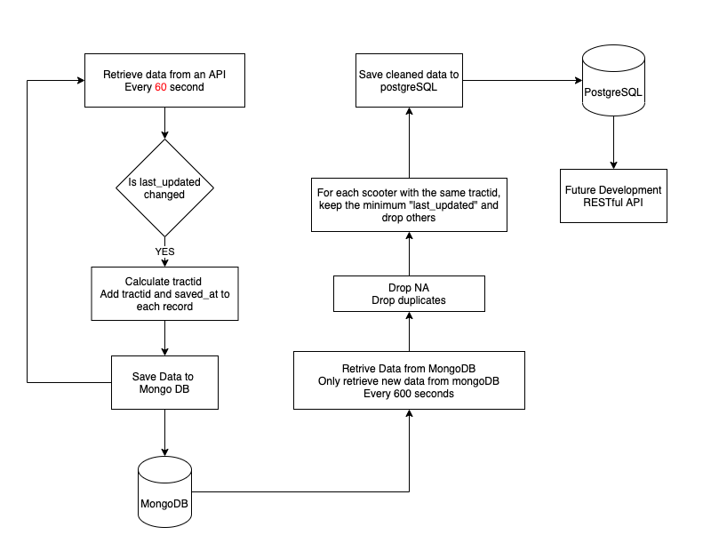
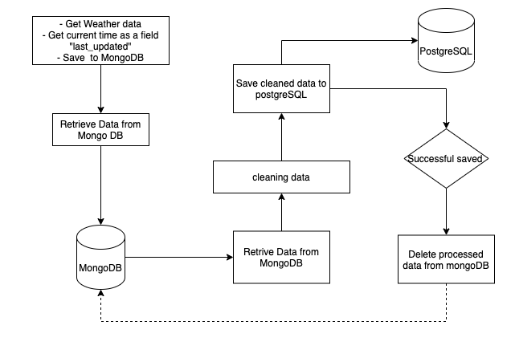

# ETL-Project

# Project report

- <a href="report.md">Please click here to review the project report</a>

# Project overview

This is project is to collect scooters data from 6 different companies in DC and DC weather data.

- First, get data from 6 different APIs every 60 seconds.
- Second, process the data and then save them to MongoDB.
- Third, every 60 minutes, retrieve data from mongoDB, clean them, and save them to postgreSQL

# Flow Chart

- Scooters data process flow chart
  

- Weather data process flow chart
  

# Lesson Learned

### try except

- Try to avoid to nest **try except** block.
  - The debud would be more difficult if nested **try except**
- Try to use **try except** for one and only one situation
  - The debug would be more difficult if **try except** multiple situation

### Clean MongoDB

- Once the data is cleaned and saved to SQL database, it is better to delete these data from MongoDB
  - The MongoDB would keep small size
