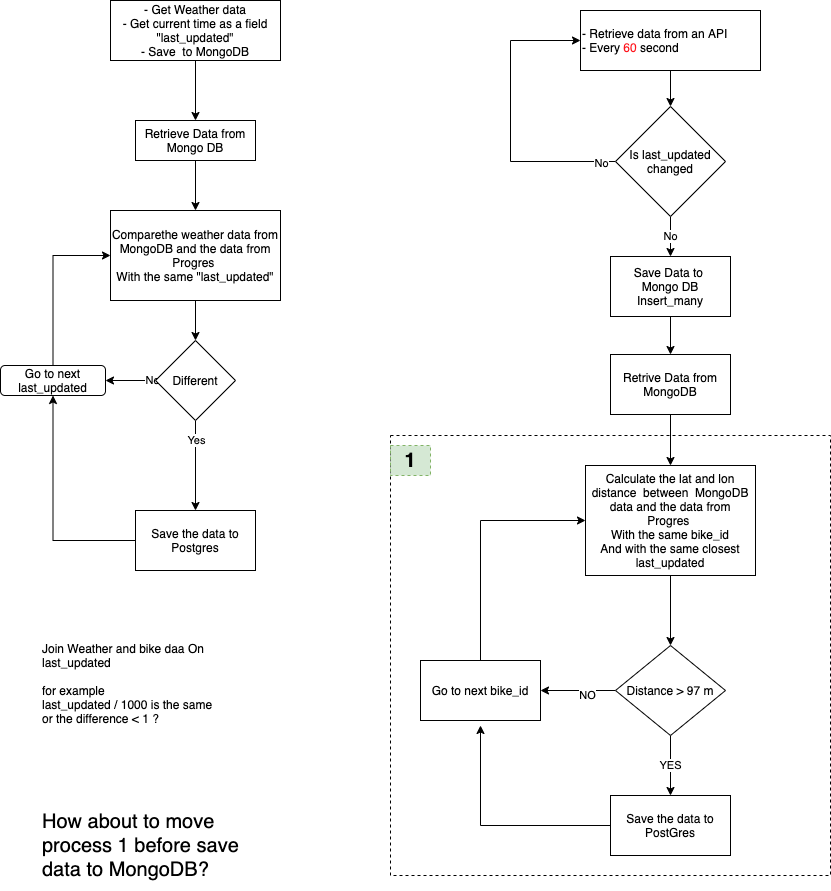

# ETL-Project

This is project is to collect scooters data from 6 different companies in DC and DC weather data.

- First, get data from 6 different APIs every 60 seconds.
- Second, process the data and then save them to MongoDB.
- Third, every 60 minutes, retrieve data from mongoDB, clean them, and save them to postgreSQL

