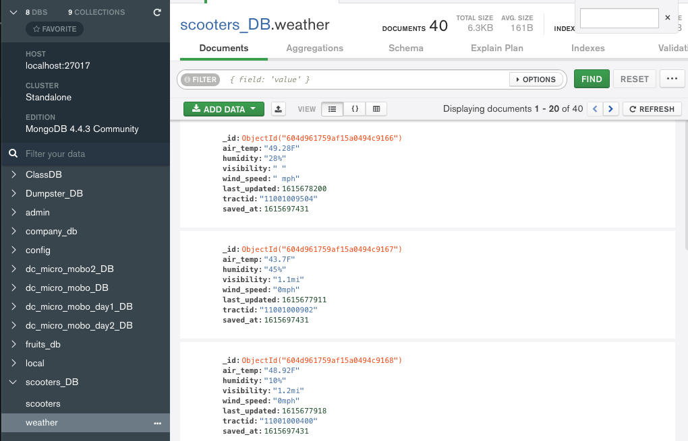

# Overview

This is project is to collect scooters data from 6 different companies in DC.

- First, get data from 6 different APIs every 60 seconds.
- Second, process the data and then save them to MongoDB.
- Third, every 60 minutes, retrieve data from mongoDB, clean them, and save them to postgreSQL

# Extract

## Data sources

- scooter data

  - Get scooter data from 6 APIs
  - API information is stored in ./Resouces/companies.py
  - API data structure layer information is stored under layer property.
  - URL
    - Lyft: https://s3.amazonaws.com/lyft-lastmile-production-iad/lbs/dca/free_bike_status.json
    - Lime: https://data.lime.bike/api/partners/v1/gbfs/washington_dc/free_bike_status.json
    - Spin: https://web.spin.pm/api/gbfs/v1/washington_dc/free_bike_status
    - Skip: https://us-central1-waybots-production.cloudfunctions.net/ddotApi-dcFreeBikeStatus
    - Bird: https://gbfs.bird.co/dc
    - Razor: https://razorapi.net/api/v1/gbfs/Washington%20DC/free_bike_status.json

- weather data
  - From Open DATA DC
  - https://opendata.dc.gov/datasets/roadway-weather-information-systems-sensors/geoservice

## Extract data

- Get scooters data from 6 APIs every 60 seconds

  - scripts: scooters.py
  - Retrieve the following useful fields from API data
    - "company": company name
    - "last_updated": When the source data was updated
    - "bike_id"
    - "lat" and "lon", the latitude and longitude at which the bike is locate at a time point
  - Add the following fields
    - "saved_at": The time to save the data to mongoDB
    - "tract_id":
      - represent a small polygon area in DC
      - DC area consists of 206 such small polygons
        
      - Calculate the polygon which the scooter is located by latitude and longitude at the specific time
        - Algorithm: https://wrf.ecse.rpi.edu/Research/Short_Notes/pnpoly.html
        - scripts: geo_polygons.py

  

- Get weather data

  - scripts: weather.py
  - Retrieve the following useful fields from API data
    - airtemp, humidity, visibiltiy, windspeed, datadatetime, lon, lat
  - Add the following fields
    - "saved_at": The time the weather data is saved to mongoDB
    - "tract_id": The polygon that weather statation is located in.

  

# Transform

## data cleaning

- scripts: mongo_to_sql.py
- Retieve data from MongoDB every 60 minutes
- Use pandas to clean data
  - dropna and drop_duplicates
  - use groupby to remove redundency
    - For records that only have last_updated different, Keep the records with minimum last_updated and drop others
    ```py
    df3 = df2.groupby(["company", "bike_id", "tractid"]).min()
    cleaned_df = df3.reset_index()
    ```

## Only clean new data from MongoDB

- Get the most recent "last_saved"
- Only retrieve data from MongoDB that are greater than "last_saved"
- Advantages:
  - Reduce the load of cleaning and calculation
  - Reduce redundancy

## Clean MongoDB for weather data

- Delect the old data from MongoDB once these data is saved to postgreSQL.
- Advantages:
  - Easily to retrieve new data from mongoDB every time
  - Keep mongoDB in small size

# Load the cleaned data to PostgreSQL

- Create database and tables: schema.sql
- Table "scooter_records"

  

- Table "weather_records"
  

- Table "process_log"

  - log the time when save to postgreSQL database
  - log the quantity saved

  

# Future development

- Deploy the app to online server, let it run 24/7
- Join scooter_records and weather_records on
  - tractid: two tractid with smallest distance join together
  - last_updated: two closest last_updated join together
- Built a RESTful API, other app can get data easily.
